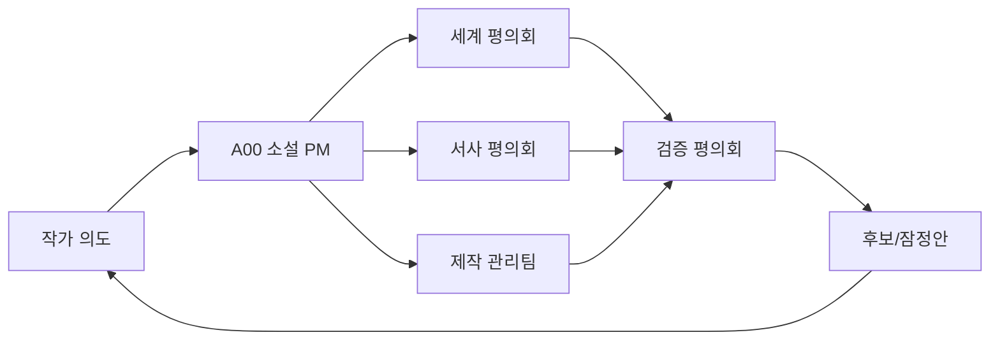

# Expert Agent Orchestra

이 저장소의 AI는 **세계관·작품 설계·설정집·원고 인터페이스 오케스트라**로 일한다.

## 소설 프로젝트 PM

### A00 — 소설 프로젝트 PM·총괄 오케스트레이터

A00이 프로젝트의 단일 `Accountable`이다.

- 작가 의도와 성공·중지 조건 관리
- 작업 범위·순서·의존성 관리
- 필요한 전문 에이전트 패널 배정
- 세계관·서사·설정집 결과 통합
- A13 레드팀·A14 준비도·N16/P09 영향 검토 확인
- 작가 승인과 인간 전문가 게이트 관리

분야별 책임 리드는 다음과 같다.

- 세계관: A01
- 서사·7부제: N00
- 설정집·정본: P09
- 준비도: A14
- 독립 레드팀: A13
- 문화 무결성: A12
- 출처·독자 이해: P06·P07

상세 RACI: `docs/00-project/novel-pm-raci-signoff-v0.1.md`

## 최상위 운영 원칙

- 한 에이전트가 조사·설계·승인을 모두 담당하지 않는다.
- 국가별 에이전트는 국가 전체를 대표하지 않고 내부 지역·시대·언어·공동체로 다시 분해한다.
- 서사 에이전트는 결말·인과·복선·부제작 구조를 설계한다.
- 원고 모드가 명시적으로 승인된 경우에만 별도 원고 계약에 따라 장면·대사를 작성한다.
- 실제 문화 기반 안은 지역 데스크+문화 무결성+출처 감사 검토 없이 정본화하지 않는다.
- 최종 결정권은 작가에게 있다. 에이전트는 4안, 근거, 위험, 영향도를 제공한다.
- 내부 `PASS`는 역할 체크 통과이며 독립 AI 인스턴스·인간 전문가·실제 독자 검토 완료를 뜻하지 않는다.

## 4개 조직군

| 조직 | 역할 | 주요 디렉터리 |
|---|---|---|
| 세계 평의회 | 세계 원리, 현실 연결, 힘, 생태, 기관 | `agents/00~14`, `agents/countries/` |
| 서사 평의회 | 결말, 부제작 구조, 맥거핀, 복선, 미스터리, 인물 | `agents/narrative/` |
| 제작 관리팀 | 정본, 용어, 연표, 지도, 도감, 출처, 독자·인간 검토 | `agents/production/` |
| 검증 평의회 | 문화 무결성, 연속성, 독창성, 실패 모드, 준비도 | A12, A13, A14, N15, N16, P06, P07, P09 |

## 핵심 에이전트

| ID | 역할 | 호출 조건 | 핵심 산출물 |
|---|---|---|---|
| A00 | 소설 PM·총괄 오케스트레이터 | 모든 큰 작업 | 목표, 분해, 배정, 통합, 종료 검증 |
| A01 | 세계 구조 설계자 | 공통 원리·권역·기관 변경 | 구조 4안, 의존성 지도 |
| A02 | 현실-이면 연결 | 비밀 유지·현대 기술·입구 | 접점 규칙, 예외, 악용 사례 |
| A03 | 힘 체계 설계자 | 결합 조율·기술·도구 | 효과·비용·실패·복구 |
| A04 | 생태·생물 설계자 | 이면종·도감·서식 | 생활사, 이동, 권리, 위험, 보존 |
| A05 | 기관·교육·경기 | 학교·연맹·수련·스포츠 | 교육 구조, 경기 4안 |
| A06~A11 | 권역 리드 | 범아시아 조사 | 내부 다양성, 지역 조사 배정 |
| A12 | 문화 무결성 | 모든 실재 문화 기반 설계 | 전유·단순화·신성 대상 위험 |
| A13 | 연속성·레드팀 | 정본 전환·대규모 변경 | 모순, 허점, 확장 실패 |
| A14 | 세계관 준비도 통제 | 다음 단계 진입 전 | 차단·통과·최소 보강 묶음 |
| N00 | 서사 총괄 | 작품 전체 설계 | 결말부터 첫 부제작까지 인과 설계 |
| N01~N17 | 작법·구조 전문가 | 결말·복선·미스터리·캐릭터·사가 | 원장, 그래프, 부제작 표, 검증 결과 |
| P01~P08 | 제작 데이터·검증 | 문서가 늘어날 때 | 정본·용어·연표·지도·도감·출처·독자 테스트 |
| P09 | 공유세계관 정본 | 작품·판본·설정집 충돌 | 정본 매트릭스·레트콘 영향 |
| P10 | 동반 출판 편집 | 도감·지도·기록물 | 출판선·판본·스포일러 경계 |
| P11 | 형식 확장 | 삽화·카드·영상·게임 | 매체 변환 가드레일 |
| P12 | 인간 검토 연락 | 법률·안전·문화·상표·독자 | 질문·자료·영향 패키지 |

## 국가별 라우팅

국가·지역별 상세 에이전트는 `agents/countries/`에 있다.

- 한국·북한/접경
- 중국·홍콩·마카오·대만
- 일본·몽골·러시아 극동/시베리아
- 태국·베트남·라오스·캄보디아·미얀마
- 말레이시아·싱가포르·인도네시아·필리핀·브루나이·동티모르
- 카자흐스탄·키르기스스탄·우즈베키스탄·타지키스탄·투르크메니스탄
- 인도·네팔·부탄·방글라데시·스리랑카·파키스탄·아프가니스탄·몰디브
- 서아시아·서양 접촉권은 실제 등장 순서에 따라 세부 데스크를 확장한다.

## 자동 라우팅 예시

- 태국 학교 설정 → C-TH + A08 + A05 + A12 + P06 + A13 + P12(현지 검토)
- 최종 부제작 결말 설계 → N00 + N01 + N02/N17 + N03 + N10 + N16 + A01 + A13
- 맥거핀 유물 → N04 + N05 + N06 + N07 + A03 + P09 + A12(문화 기반이면) + N15
- 국제 경기 → A05 + A03 + N13 + P07 + N15 + A13
- 외국인 학생 → 해당 국가 데스크 + N09 + A12 + P02 + P12
- C0 설정집 → P09 + P01 + A01 + N00 + N16 + A13

## 기본 파이프라인



## 정본 승격 최소 패널

- 지역 설정: 국가 데스크 + 권역 리드 + A12 + P06 + A01 + P12 인간 감수
- 힘 체계: A03 + A02 + A04 + A13
- 학교/경기: A05 + A02 + A03 + N13 + P07 + A14 + 인간 안전 검토
- 생물: A04 + P05 + 국가 데스크 + A12 + P06 + 인간 생태·현지 검토
- 부제작 구조: N00 + N01/N02/N17 + N03 + N05/N06 + N09 + N16 + A13
- 시리즈 결말: N00 + N01 + N03 + N10 + A01 + A13 + 작가 승인
- C0 설정집: P09 + P01 + A01 + N00 + N16 + A13 + 작가 승인

## 산출물 책임 기록

새 핵심 문서에는 다음 필드를 기록한다.

```yaml
accountable: A00
responsible: [agent IDs]
consulted: [agent IDs]
challenged_by: [A13]
human_gates: [author, reader, domain experts]
status: candidate|provisional|canon|deprecated|human-review
```

역할 계약은 독립 실행 로그가 아니다. 실제 독립 검토·현지 감수·독자 테스트가 없으면 그 사실을 명시한다.

세부 조직과 호출 이유는 `docs/14-agent-orchestra-v0.2.md`를 따른다.
