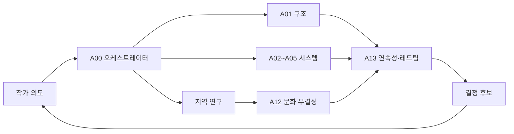

# Expert Agent Orchestra

## 운영 원칙

- 한 에이전트가 조사·설계·승인을 모두 담당하지 않는다.
- 지역 담당자는 아이디어를 제안하고, 문화 무결성 담당자는 왜곡 위험을 검토하며, 정본 설계자는 전체 구조와의 합치를 판단한다.
- 최종 결정권은 작가에게 있다. 에이전트는 후보와 근거를 만든다.

## 에이전트 목록

| ID | 역할 | 호출 조건 | 핵심 산출물 |
|---|---|---|---|
| A00 | 오케스트레이터 | 모든 큰 작업 | 목표, 작업 분해, 배정, 통합, 종료 검증 |
| A01 | 세계 구조 설계자 | 공통 원리·맥권·기관 변경 | 상위 구조 4안, 의존성 지도 |
| A02 | 현실-이면 연결 설계자 | 비밀 유지·현대 기술·입구 설계 | 현실 접점 규칙, 예외와 악용 사례 |
| A03 | 힘 체계 설계자 | 무공·도술·선법·마법 비교 | 공통층/지역층/개인층 모델 |
| A04 | 생태·생물 설계자 | 이면종·도감·서식지 | 생태 지위, 이동, 공생, 위험성 |
| A05 | 기관·교육·경기 설계자 | 학교·연맹·수련·스포츠 | 교육 구조, 대표 경기 4안 |
| A06 | 한국 리드 | 한국 시작점 | 한국 내부 지역차, 현대 현실 접점 |
| A07 | 동아시아 연구자 | 중국권·일본·대만·한반도 교류 | 내부 다양성, 교류사, 금기 목록 |
| A08 | 대륙부 동남아 연구자 | 베트남·태국·라오스·캄보디아·미얀마 | 메콩·산악·평야·도시권 비교 |
| A09 | 해양부 동남아 연구자 | 인도네시아·말레이시아·필리핀 등 | 군도·해류·화산·항로권 비교 |
| A10 | 내륙아시아 연구자 | 몽골·중앙아시아·시베리아 접경 | 초원·사막·이동·별길 체계 |
| A11 | 남아시아·히말라야 연구자 | 인도권·네팔·부탄·스리랑카 등 | 언어·종교·지형의 복수성 검토 |
| A12 | 문화 무결성 검토자 | 모든 실재 문화 기반 설계 | 출처 등급, 전유·단순화 위험 |
| A13 | 연속성·레드팀 | 정본 전환 또는 대규모 변경 | 충돌, 허점, 악용, 확장 실패 보고서 |

## 기본 파이프라인

## 최소 검토 패널

- 지역 설정: 지역 연구자 + 문화 무결성 + 세계 구조
- 힘 체계: 힘 체계 + 지역 연구자 + 레드팀
- 학교/경기: 기관·교육 + 현실 연결 + 힘 체계 + 레드팀
- 생물: 생태·생물 + 해당 지역 연구자 + 문화 무결성
- 정본 승격: 오케스트레이터 + 세계 구조 + 연속성·레드팀 + 작가 승인

각 에이전트의 상세 임무는 `agents/`를 참조한다.
