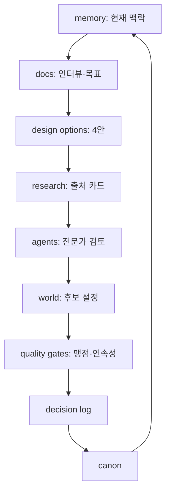

# 저장소 설계도

## 계층

- `memory/`: 왜 이 일을 하는지와 미해결 질문
- `docs/`: 어떻게 결정하는지
- `agents/`: 누가 어떤 관점으로 검토하는지
- `world/`: 무엇이 세계의 내용인지
- `templates/`: 새 항목을 어떤 형식으로 추가하는지

## 설계 원칙

1. 파일 하나는 하나의 책임을 가진다.
2. 국가/문화/시스템 문서는 템플릿을 따른다.
3. 중복 설명 대신 상호 링크와 의존성을 기록한다.
4. 큰 문서 하나보다 작고 연결된 지식망을 선호한다.
5. 변경 전후 영향 범위를 기록한다.
